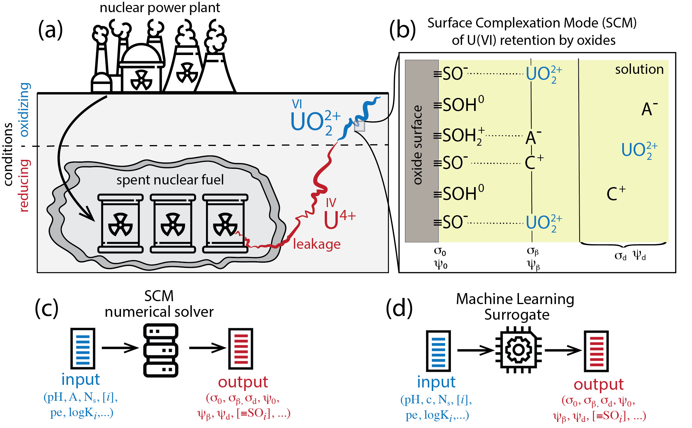

# Uranium-Sorption-Surrogate
A machine learning surrogate model of surface complexation models (SCM) for uranium sorption on oxide surfaces. 

# dataset 
data used in this work can be downloaded from https://zenodo.org/records/10815543

# Train the model using the jupyter notebook 
using the Jupyter Notebook 
